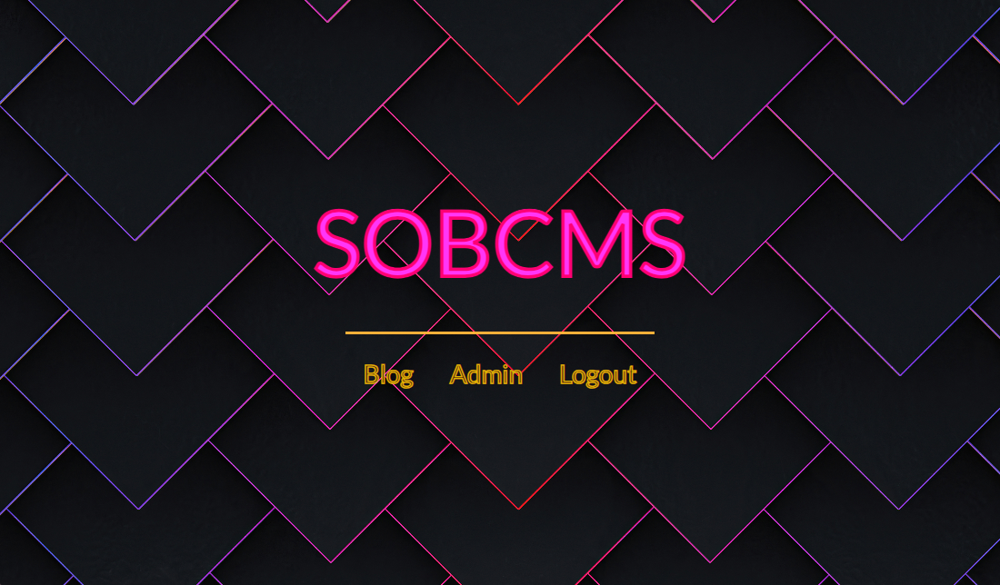

# <h1 align="center">SOBCMS</h1>
<div align="center">
  
</div>
<p align="center">
  <a href="#dart-description">Description</a> &#xa0; | &#xa0; 
  <a href="#dart-demo">Demo</a> &#xa0; | &#xa0;
  <a href="#art-technologies">Technologies</a> &#xa0; | &#xa0;
  <a href="#white_check_mark-requirements">Requirements</a> &#xa0; | &#xa0;
  <a href="#toolbox-installation">Installation</a> &#xa0; | &#xa0;
  <a href="#joystick-how-to-config-a-tinymce-editor">How to config a TinyMCE editor</a> &#xa0; | &#xa0;
  <a href="#briefcase-license">License</a> &#xa0; | &#xa0;
  <a href="https://github.com/arturomsoberanes" target="_blank">Author</a>
</p>

<br>


## :dart: Description ##

Is a lightweight and versatile micro Content Management System (CMS) thoughtfully crafted in PHP, exclusively tailored to cater to your personal project needs. This compact yet powerful CMS enables you to efficiently create and manage content without the complexity of larger systems, making it an ideal companion for your individual endeavors.

## :desktop_computer: Demo ##

If you want watch a demo of this project
please click [here](https://sobcms.onrender.com)

## :art: Technologies ##

- [HTML](https://www.w3schools.com/html/)
- [CSS](https://www.w3schools.com/css/)
- [PHP](https://www.php.net)
- [Composer](https://getcomposer.org/)
- [illuminate/database](https://packagist.org/packages/illuminate/database)
- [pecee/simple-router](https://packagist.org/packages/pecee/simple-router)
- [MYSQL](https://www.mysql.com/)

Or you can run a mysql container with:
- [Docker](https://www.docker.com/)

## :white_check_mark: Requirements ##

Before starting :checkered_flag:, you need to have:
- [Git](https://git-scm.com).
- [PHP V8.1](https://www.php.net/ChangeLog-8.php#8.1.20)
- [Composer](https://getcomposer.org/)
- [MYSQL](https://www.mysql.com/)

## :toolbox: Installation ##

Clone Repository

```bash
$ git clone https://github.com/arturomsoberanes/sobcms.git
```
Go to directory

```bash
$ cd sobcms
```

Install the dependecies

```bash
$ composer install 
```

You con use XAMPP or WAMP for run the proyect but if you prefer you can use

```bash
$ php -S localhost:8080
```

### Deploy with Docker

You also can use docker for deploy, change the branch from main to deploy
and remove the lines that i use for deploy my app on render.com.

Once you're finished run the command for create the image

```bash
$ docker build -t sobcms .
```

Run the container

```bash
$ docker run -d -p 443:443 sobcms
```


The app will show you a form for create your config file

And that's it!


## :joystick: How to config a TinyMCE editor ##

For use the TinyMCE editor you'll should have the Tiny API key from:
[Tiny Cloud](https://www.tiny.cloud/)

Once you have the Tiny API key you can add it in your config file
like i show you in <a href="#toolbox-installation">"Installation"</a>

And that's all!!


## :briefcase:	 License ##

This project is under license from MIT. For more details, see the [LICENSE](LICENSE) file.


Made with :heart: by <a href="https://github.com/arturomsoberanes" target="_blank">Arturo Soberanes</a>

&#xa0;

<a href="#top">Back to top</a>